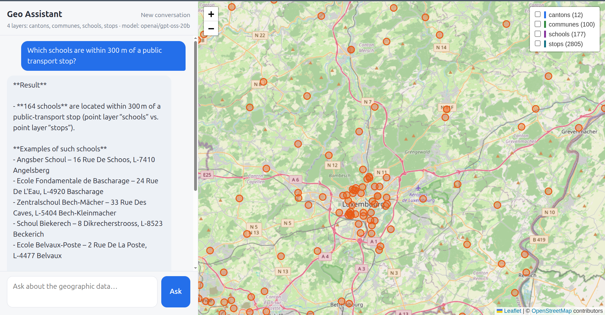
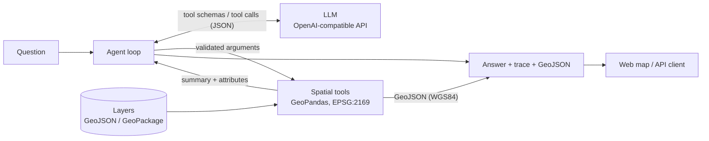

# Geo Assistant

Ask questions about geospatial data in plain language and get answers you can trace: an LLM chooses among whitelisted spatial tools, and every number comes from GeoPandas, not from the model.

Live demo: <URL> (free hosting, first load may take ~1 min)

[](https://github.com/rabieessayeh/geo-assistant/actions/workflows/ci.yml)

[](LICENSE)



## Why

Language models are a convenient interface to geospatial data, but they invent figures and place names when asked to compute.
Geo Assistant separates the two jobs:

- **The LLM only decides what to compute.** It picks a tool from a fixed whitelist and fills in its arguments. It never writes or executes code.
- **Deterministic tools do the computing.** Distances, counts and nearest neighbours are produced by GeoPandas on the loaded layers.
- **Every answer is traceable.** The response carries the list of tool calls that produced it and the resulting features as GeoJSON, shown on a map.

## Features

- Four spatial tools: `list_layers`, `within_distance`, `count_in_polygons`, `nearest`.
- Tool arguments validated with Pydantic before anything runs; errors are returned to the model so it can correct itself.
- Works with any OpenAI-compatible LLM endpoint (hosted or local), with retry and backoff on rate limits.
- Web map (Leaflet, no build step): chat panel, tool-call trace, results drawn on the map, layer toggles.
- JSON API (FastAPI) with interactive docs at `/docs`; tools can be called directly, without an LLM.
- Real open data for Luxembourg (included, refreshed by script), plus a synthetic dataset for tests.
- Evaluation set measuring how often the model picks the right tool and arguments.
- Optional per-visitor and global rate limits on `/ask`, for public demos running on a shared LLM quota.
- Tests that run without network or API key, linting with ruff, Docker image and CI workflow.

## Architecture



- **Deterministic tools.** The model sees tool results as compact summaries and attribute rows; geometries go straight to the client and never pass through the model.
- **EPSG:2169 for computation.** Layers are reprojected to LUREF / Luxembourg TM so that distances are in metres; results are returned in WGS84 (EPSG:4326) for web maps.
- **Provider-agnostic LLM.** The agent speaks the OpenAI chat-completions protocol, so switching between a hosted model and a local open-weight model is a matter of three environment variables.
- **One source of truth for tools.** Each tool's argument model generates both the JSON schema sent to the LLM and the validation applied to its reply.

## Quick start

Requires Python 3.11 or later.

```bash
git clone https://github.com/rabieessayeh/geo-assistant.git
cd geo-assistant
python -m venv .venv && source .venv/bin/activate
pip install -e ".[dev]"

cp .env.example .env        # then set the LLM endpoint, see "LLM providers"
uvicorn app.api:app --reload
```

Open <http://localhost:8000/>. The repository ships a small synthetic dataset in `data/sample/` (regenerate it with `python scripts/make_sample_data.py`), so the application runs as soon as an LLM endpoint is configured.

To use the real Luxembourg layers of `data/lux/` instead:

```bash
DATA_DIR=data/lux uvicorn app.api:app
python scripts/fetch_lux_data.py     # optional: refresh data/lux/ from the portal
```

Or with Docker:

```bash
cp .env.example .env
docker compose up --build
```

With Compose the dataset follows `DATA_DIR` in `.env` (the sample by default; set `DATA_DIR=data/lux` for the real layers). The image limits `/ask` to 10 questions per hour per visitor (see [Deployment](#deployment)); add `ASK_RATE_LIMIT=0` to `.env` to lift the limit locally.

### Example questions

- Which schools are within 300 m of a public transport stop?
- How many stops are there in each commune?
- Which canton has the most schools? *(real data only)*
- What are the 3 nearest stops to longitude 6.13, latitude 49.61?

### API

```bash
# Natural-language question -> answer, trace and GeoJSON
curl -X POST localhost:8000/ask -H "Content-Type: application/json" \
     -d '{"question": "Which schools are within 300 m of a stop?"}'

# Call a tool directly, without an LLM
curl -X POST localhost:8000/tools -H "Content-Type: application/json" \
     -d '{"tool": "count_in_polygons", "args": {"points": "stops", "polygons": "communes", "label": "name"}}'

# Describe the layers, or fetch one as GeoJSON
curl localhost:8000/layers
curl "localhost:8000/layers/stops?limit=10"
```

`POST /ask` also accepts a `history` list of previous `user` / `assistant` messages for follow-up questions. `GET /health` reports the loaded layers and the configured model, and `GET /sources` returns the provenance of the layers.

## LLM providers

The agent needs a model that supports tool calling, reached through an OpenAI-compatible endpoint. Set these variables in `.env`:

| Provider | `LLM_BASE_URL` | `LLM_MODEL` (example) | `LLM_API_KEY` | Status |
| --- | --- | --- | --- | --- |
| Groq (gpt-oss) | `https://api.groq.com/openai/v1` | `openai/gpt-oss-20b` | Groq key | **Tested** |
| Mistral | `https://api.mistral.ai/v1` | `mistral-small-latest` | Mistral key | Not tested |
| Google Gemini | `https://generativelanguage.googleapis.com/v1beta/openai/` | `gemini-2.5-flash` | Gemini key | Not tested |
| Ollama (local) | `http://localhost:11434/v1` | `gpt-oss:20b` | any value | Not tested |

Only the Groq configuration has been run end to end with this version of the code. The other rows follow each provider's documented OpenAI-compatible endpoint; model names change over time, so check the provider's current list.

Optional settings (timeouts and retries, `MAX_STEPS`, `DATA_DIR`, `LOG_LEVEL`, rate limits) are documented in [.env.example](.env.example).

## Data

### Sources

The layers of `data/lux/` are versioned in this repository. They were produced by `scripts/fetch_lux_data.py`, which downloads open data published on [data.public.lu](https://data.public.lu), keeps the useful columns and writes one GeoJSON file per layer, together with a `SOURCES.json` file recording the exact resources and the download time.

| Layer | Dataset | Publisher | Licence |
| --- | --- | --- | --- |
| `communes`, `cantons` | [Limites administratives du Grand-Duché de Luxembourg](https://data.public.lu/en/datasets/limites-administratives-du-grand-duche-de-luxembourg/) | Administration du cadastre et de la topographie | CC0 |
| `stops` | [Horaires et arrêts des transport publics (GTFS)](https://data.public.lu/en/datasets/horaires-et-arrets-des-transport-publics-gtfs/) | Administration des transports publics | CC BY |
| `schools` | [Adresses des bâtiments scolaires 2021](https://data.public.lu/en/datasets/adresses-des-batiments-scolaires-2021/) | Ministère de l'Éducation nationale, de l'Enfance et de la Jeunesse | CC0 |

Things to know about these layers:

- **Schools are geocoded.** The source lists addresses without coordinates, so the script geocodes them with the national geocoder (`apiv4.geoportail.lu`). Only house-number matches are kept; the others are logged and dropped rather than placed approximately. On 2026-10-01 this kept 177 of 218 schools.
- **Schools date from 2021** and cover public primary schools (*écoles fondamentales*) and secondary schools (*lycées*).
- **Stops include cross-border stops** served by Luxembourg lines, so some lie outside every commune.
- Resource URLs on the portal change at each update. The script resolves them through the portal API from the dataset identifiers, which are constants at the top of the script.

The map background uses OpenStreetMap tiles (© OpenStreetMap contributors).

### Adding a layer

Drop a `.geojson`, `.gpkg` or `.shp` file with a defined CRS into the data folder and restart the API. The file name becomes the layer name, and the layer is immediately available to every tool. No code change is needed: the model discovers layers and their attributes through `list_layers`.

## Evaluation

Because the numbers come from deterministic tools, an answer is correct when the model chose the right tool with the right arguments. That is what the evaluation measures.

```bash
python eval/run_eval.py --delay 2      # needs a configured LLM
```

[eval/questions.yaml](eval/questions.yaml) holds 10 questions on the sample data, each with the expected tool call. They include a unit conversion, coordinates given latitude-first, a question in French, and an out-of-scope question where no data tool should be called. The script reports two figures:

- **Tool accuracy**: the expected tool was called, and no other tool apart from `list_layers`.
- **Argument accuracy**: one call of that tool carried the expected arguments.

`--out results.json` saves the per-question detail, and `--data` points the run at another layer folder. The evaluation does not judge the wording of the final answer.

## Deployment

### Docker image (Render and similar hosts)

The [Dockerfile](Dockerfile) builds a self-contained image for a public demo:

- It includes `data/lux/` and sets `DATA_DIR=data/lux`.
- It listens on the port given by the `PORT` environment variable (8000 if unset), as hosting platforms such as Render expect.
- It limits `/ask` to 10 questions per hour per visitor. Further questions get an HTTP 429 with a message shown in the chat; the other endpoints are not limited.

On the host, create a web service from this repository with the Docker runtime and set `LLM_BASE_URL`, `LLM_MODEL` and `LLM_API_KEY` as environment variables (the key as a secret). No `.env` file is used: it is excluded from both git and the image.

### Hugging Face Space

The application can also be published as a [Hugging Face Space](https://huggingface.co/docs/hub/spaces-sdks-docker) (Docker SDK, port 7860). The Space is a separate git repository, assembled from this one:

```bash
python scripts/build_space.py ../geo-assistant-space
```

The script copies the application, `data/lux/` with its `SOURCES.json`, and the Space's own `README.md` and `Dockerfile` from [deploy/huggingface/](deploy/huggingface/). Files are taken from an explicit list, so `.env` is never copied: the API key is provided to the Space as a secret named `LLM_API_KEY`.

### Rate limit

`/ask` is rate limited with `ASK_RATE_LIMIT` (questions per visitor per window) and `ASK_GLOBAL_LIMIT` (questions per window in total). Both are off by default when running from source and are set in the Dockerfiles. Visitors are identified by the first address of `X-Forwarded-For` when `TRUST_FORWARDED_FOR` is enabled, and by the connection address otherwise. A client can forge that header, which is what the optional global limit is for. Counters are kept in memory and reset when the container restarts.

## Project structure

```
geo-assistant/
├── app/
│   ├── tools.py            # spatial tools, argument models, tool registry
│   ├── agent.py            # LLM tool-calling loop with retry
│   ├── api.py              # FastAPI application
│   ├── config.py           # settings (pydantic-settings) and logging
│   ├── evaluation.py       # scoring of tool choices
│   ├── ratelimit.py        # in-memory rate limiter for /ask
│   └── static/index.html   # map front-end (Leaflet)
├── scripts/
│   ├── fetch_lux_data.py   # download and clean real Luxembourg data
│   ├── make_sample_data.py # synthetic dataset
│   └── build_space.py      # assemble the Hugging Face Space folder
├── eval/
│   ├── questions.yaml      # evaluation set
│   └── run_eval.py         # evaluation runner
├── tests/                  # pytest suite (offline)
├── data/sample/            # synthetic layers, used by the tests and the evaluation
├── data/lux/               # real Luxembourg layers and SOURCES.json
├── deploy/huggingface/     # README header and Dockerfile of the Space
├── Dockerfile
├── docker-compose.yml
├── pyproject.toml          # dependencies, ruff and pytest configuration
└── .github/workflows/ci.yml
```

## Testing

```bash
ruff check . && ruff format --check .
pytest
```

The suite needs neither network access nor an API key: the agent is driven by a scripted fake LLM, the API is exercised with FastAPI's `TestClient`, and the data-cleaning functions run on small in-memory inputs. It covers the spatial results, argument validation, the retry logic, the HTTP endpoints and the evaluation scoring. The same commands run in CI on every push.

## Roadmap

- PostGIS backend, so layers are queried in the database instead of loaded in memory
- OGC API Features endpoints for the layers and results
- 3D view of results with CesiumJS
- More tools: attribute filters, buffers and intersections, area statistics
- Answer-level evaluation, and evaluation on the real Luxembourg layers

## License

[MIT](LICENSE)

## Author

**Rabie ES-SAYEH** · [GitHub](https://github.com/rabieessayeh) · [Portfolio](https://rabieessayeh.github.io/profile/)
