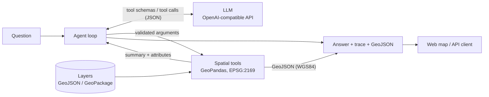

# Geo Assistant

Ask questions about geospatial data in plain language and get answers you can trace: an LLM chooses among whitelisted spatial tools, and every number comes from GeoPandas, not from the model.

[](https://github.com/rabieessayeh/geo-assistant/actions/workflows/ci.yml)

[](LICENSE)
[](https://geo-assistant.onrender.com/)

Live demo: https://geo-assistant.onrender.com/ (free hosting: the first load can take up to a minute; questions are limited per visitor)


## Try it

The demo runs on real open data for Luxembourg: communes, cantons, public transport stops and schools. These questions each map to one tool call:

| Question | Tool |
| --- | --- |
| Which canton has the most schools? | `count_in_polygons` |
| How many public transport stops are there in each commune? | `count_in_polygons` |
| Which schools are within 100 m of a public transport stop? | `within_distance` |
| What are the 3 nearest stops to longitude 6.13, latitude 49.61? | `nearest` |
| What are the 5 nearest schools to longitude 5.98, latitude 49.50? | `nearest` |

Each answer shows the tool calls that produced it and draws the result on the map.

## Why

Language models are a convenient interface to geospatial data, but they invent figures and place names when asked to compute. Geo Assistant separates the two jobs:

- **The LLM only decides what to compute.** It picks a tool from a fixed whitelist and fills in its arguments. It never writes or executes code.
- **Deterministic tools do the computing.** Distances, counts and nearest neighbours are produced by GeoPandas on the loaded layers.
- **Every answer is traceable.** The response carries the tool calls that produced it and the resulting features as GeoJSON.

## Features

- Four spatial tools: `list_layers`, `within_distance`, `count_in_polygons`, `nearest`.
- Tool arguments validated with Pydantic before anything runs. Errors go back to the model so it can correct itself.
- Any OpenAI-compatible LLM endpoint, hosted or local, with retry and backoff on rate limits.
- Web map (Leaflet, no build step): chat, tool-call trace, results on the map, layer toggles.
- JSON API (FastAPI) with interactive docs at `/docs`. Tools can be called directly, without an LLM.
- Evaluation set measuring how often the model picks the right tool and arguments.
- Rate limit on `/ask` for public demos.
- Offline test suite, ruff, Docker image, CI.

## Architecture



- **Deterministic tools.** The model receives compact summaries and attribute rows. Geometries go straight to the client and never pass through the model.
- **EPSG:2169 for computation.** Layers are reprojected to LUREF / Luxembourg TM, so distances are in metres. Results are returned in WGS84 (EPSG:4326) for web maps.
- **Provider-agnostic LLM.** The agent speaks the OpenAI chat-completions protocol. Switching model or provider means changing three environment variables.
- **One source of truth for tools.** Each tool's argument model generates both the JSON schema sent to the LLM and the validation applied to its reply.

## Quick start

Requires Python 3.11 or later.

```bash
git clone https://github.com/rabieessayeh/geo-assistant.git
cd geo-assistant
python -m venv .venv && source .venv/bin/activate
pip install -e ".[dev]"

cp .env.example .env        # then set the LLM endpoint, see "LLM providers"
DATA_DIR=data/lux uvicorn app.api:app --reload
```

Open <http://localhost:8000/>. Without `DATA_DIR`, the application loads the small synthetic dataset of `data/sample/`.

### API

```bash
# Natural-language question -> answer, trace and GeoJSON
curl -X POST localhost:8000/ask -H "Content-Type: application/json" \
     -d '{"question": "Which canton has the most schools?"}'

# Call a tool directly, without an LLM
curl -X POST localhost:8000/tools -H "Content-Type: application/json" \
     -d '{"tool": "count_in_polygons", "args": {"points": "stops", "polygons": "communes", "label": "name"}}'

# Describe the layers, or fetch one as GeoJSON
curl localhost:8000/layers
curl "localhost:8000/layers/stops?limit=10"
```

`POST /ask` also accepts a `history` list of previous `user` / `assistant` messages for follow-up questions. `GET /health` reports the loaded layers and the configured model. `GET /sources` returns the provenance of the layers.

## LLM providers

The agent needs a model that supports tool calling, reached through an OpenAI-compatible endpoint. Set these variables in `.env`:

| Provider | `LLM_BASE_URL` | `LLM_MODEL` (example) | `LLM_API_KEY` | Status |
| --- | --- | --- | --- | --- |
| Groq (gpt-oss) | `https://api.groq.com/openai/v1` | `openai/gpt-oss-20b` | Groq key | **Tested** |
| Mistral | `https://api.mistral.ai/v1` | `mistral-small-latest` | Mistral key | Not tested |
| Google Gemini | `https://generativelanguage.googleapis.com/v1beta/openai/` | `<gemini-model>` | Gemini key | Not tested |
| Ollama (local) | `http://localhost:11434/v1` | `gpt-oss:20b` | any value | Not tested |

Only the Groq configuration has been run end to end. The other rows follow each provider's documented OpenAI-compatible endpoint. Model names change over time: check the provider's current list.

Other settings (timeouts, retries, `MAX_STEPS`, `LOG_LEVEL`, rate limits) are documented in [.env.example](.env.example).

## Data

The layers of `data/lux/` are versioned in this repository. They come from [data.public.lu](https://data.public.lu) under CC0 and CC BY licences. `data/lux/SOURCES.json` records the publisher, licence, exact resources and download time of each layer, and the map credits the publishers.

| Layer | Dataset | Publisher | Licence |
| --- | --- | --- | --- |
| `communes`, `cantons` | [Limites administratives du Grand-Duché de Luxembourg](https://data.public.lu/en/datasets/limites-administratives-du-grand-duche-de-luxembourg/) | Administration du cadastre et de la topographie | CC0 |
| `stops` | [Horaires et arrêts des transport publics (GTFS)](https://data.public.lu/en/datasets/horaires-et-arrets-des-transport-publics-gtfs/) | Administration des transports publics | CC BY |
| `schools` | [Adresses des bâtiments scolaires 2021](https://data.public.lu/en/datasets/adresses-des-batiments-scolaires-2021/) | Ministère de l'Éducation nationale, de l'Enfance et de la Jeunesse | CC0 |

To refresh the layers, run `python scripts/fetch_lux_data.py`. It resolves the current resources through the portal API, keeps the useful columns and rewrites `data/lux/`.

Limits of these layers:

- **Schools are geocoded.** The source lists addresses without coordinates, so the script geocodes them with the national geocoder (`apiv4.geoportail.lu`). Only house-number matches are kept: 177 of 218 schools on 2026-10-01. The others are logged and dropped rather than placed approximately.
- **Schools date from 2021.** The list covers public primary schools (*écoles fondamentales*) and secondary schools (*lycées*).
- **Stops include cross-border stops** served by Luxembourg lines, so some lie outside every commune.

The map background uses OpenStreetMap tiles (© OpenStreetMap contributors).

### Adding a layer

Drop a `.geojson`, `.gpkg` or `.shp` file with a defined CRS into the data folder and restart the API. The file name becomes the layer name. No code change is needed: the model discovers layers and their attributes through `list_layers`.

## Evaluation

Because the numbers come from deterministic tools, an answer is correct when the model chose the right tool with the right arguments. That is what the evaluation measures.

```bash
python eval/run_eval.py --delay 2      # needs a configured LLM
```

[eval/questions.yaml](eval/questions.yaml) holds 10 questions on the synthetic sample data, each with the expected tool call. They include a unit conversion, coordinates given latitude-first, a question in French, and an out-of-scope question where no data tool should be called. The script reports two figures:

- **Tool accuracy**: the expected tool was called, and no other tool apart from `list_layers`.
- **Argument accuracy**: one call of that tool carried the expected arguments.

**Results.** On this 10-question set, `openai/gpt-oss-20b` via Groq selected the expected tool and arguments in 10/10 cases (single run, 2026-10-01). This is a small sanity check, not a benchmark.

The evaluation does not judge the wording of the final answer. `--out results.json` saves the per-question detail.

## Deployment

### Render (live demo)

The demo is a Render web service on the free plan, built from the [Dockerfile](Dockerfile) of this repository:

- The image ships `data/lux/` and sets `DATA_DIR=data/lux`.
- It listens on the port Render provides in `$PORT` (8000 if unset).
- It limits `/ask` to 10 questions per hour per visitor (see below).
- `LLM_BASE_URL`, `LLM_MODEL` and `LLM_API_KEY` are set as environment variables of the service. No `.env` file is used: it is excluded from both git and the image.

### Docker, locally

```bash
cp .env.example .env        # set the LLM endpoint
docker compose up --build   # http://localhost:8000
```

Compose mounts `./data` and reads `.env`. Set `DATA_DIR=data/lux` there for the real layers, and `ASK_RATE_LIMIT=0` to lift the rate limit.

### Rate limit

`ASK_RATE_LIMIT` sets the number of questions per visitor per window (`ASK_RATE_WINDOW_S`, one hour by default). Beyond it, `/ask` returns HTTP 429 with a message shown in the chat. The other endpoints are not limited.

- The limit is off by default when running from source. The Dockerfile sets it to 10.
- Visitors are identified by the first address of `X-Forwarded-For` when `TRUST_FORWARDED_FOR` is enabled, otherwise by the connection address.
- A client can forge that header. `ASK_GLOBAL_LIMIT` caps the total number of questions per window; it is off unless set.
- Counters are kept in memory and reset when the container restarts.

### Hugging Face Space (alternative)

`python scripts/build_space.py ../geo-assistant-space` assembles the files of a Docker Space (port 7860) from an explicit list: the application, `data/lux/`, and the Space `README.md` and `Dockerfile` of [deploy/huggingface/](deploy/huggingface/). The API key is read from a Space secret named `LLM_API_KEY`.

## Project structure

```
geo-assistant/
├── app/
│   ├── tools.py            # spatial tools, argument models, tool registry
│   ├── agent.py            # LLM tool-calling loop with retry
│   ├── api.py              # FastAPI application
│   ├── config.py           # settings (pydantic-settings) and logging
│   ├── evaluation.py       # scoring of tool choices
│   ├── ratelimit.py        # in-memory rate limiter for /ask
│   └── static/index.html   # map front-end (Leaflet)
├── scripts/
│   ├── fetch_lux_data.py   # download and clean the Luxembourg layers
│   ├── make_sample_data.py # generate the synthetic dataset
│   └── build_space.py      # assemble the Hugging Face Space folder
├── eval/
│   ├── questions.yaml      # evaluation set
│   └── run_eval.py         # evaluation runner
├── tests/                  # pytest suite (offline)
├── data/
│   ├── lux/                # real Luxembourg layers and SOURCES.json
│   └── sample/             # synthetic layers for tests and evaluation
├── deploy/huggingface/     # README header and Dockerfile of the Space
├── docs/screenshot.png
├── Dockerfile              # image used on Render
├── docker-compose.yml
├── pyproject.toml          # dependencies, ruff and pytest configuration
└── .github/workflows/ci.yml
```

## Testing

```bash
ruff check . && ruff format --check .
pytest
```

The suite needs neither network access nor an API key. The agent is driven by a scripted fake LLM, the API is exercised with FastAPI's `TestClient`, and the data-cleaning functions run on small in-memory inputs. It covers the spatial results, argument validation, the retry logic, the rate limit, the HTTP endpoints and the evaluation scoring. The same commands run in CI on every push.

## Roadmap

- PostGIS backend, so layers are queried in the database instead of loaded in memory
- OGC API Features endpoints for the layers and results
- 3D view of results with CesiumJS
- More tools: attribute filters, buffers and intersections, area statistics
- Answer-level evaluation, and evaluation on the real Luxembourg layers

## License

[MIT](LICENSE)

## Author

**Rabie ES-SAYEH** · [GitHub](https://github.com/rabieessayeh) · [Portfolio](https://rabieessayeh.github.io/profile/)
